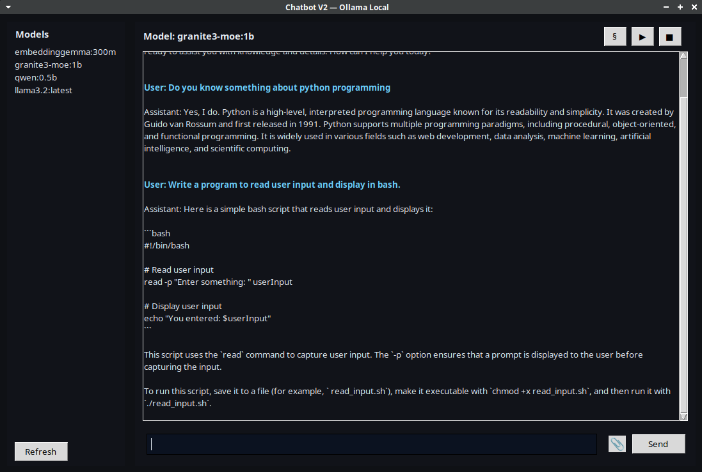
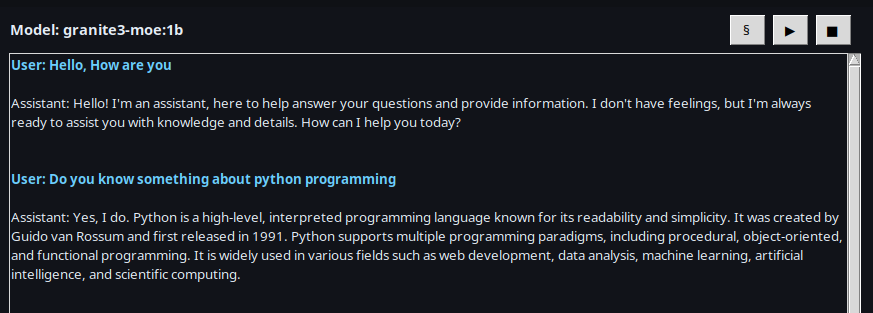
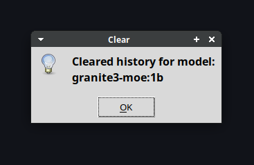

# Installation
Install Required Tools First:
<b> python 3.10.19 </b>
<b> virtualenv </b>

<h4> Step 1: </h4>
  <b> Run: </b> "virtualenv MyChatbot"
  <b> Run: </b> "source MyChatbot/bin/activate"
  
<h4> Step 2: </h4>
  Run Terminal and type this command:
  <code> ./setup.sh </code>

<h4> Step 3: </h4>
  Setup Ollama, Install models, Run ollama service:
   <b> Run: </b> "ollama serve & clear"
   <b> Run: </b> "ollama pull qwen:0.5b"
   <b> Run: </b> "ollama run qwen:0.5b"
  
<h4> Step 4: </h4>
  Run in Terminal:
  <code> python chatbot.py </code>

# Testing Demo

